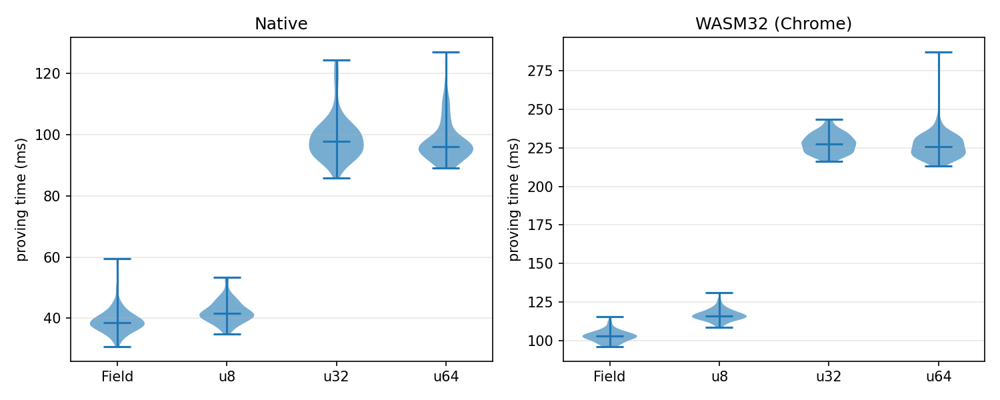
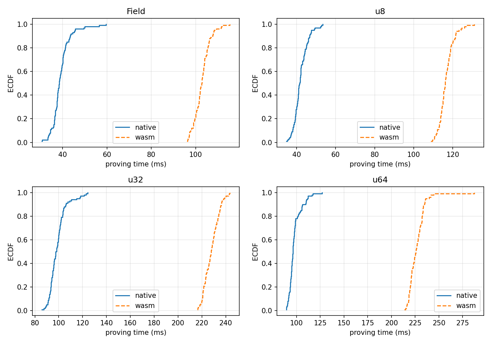
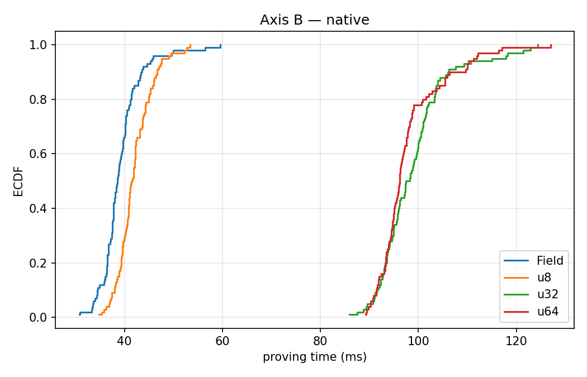
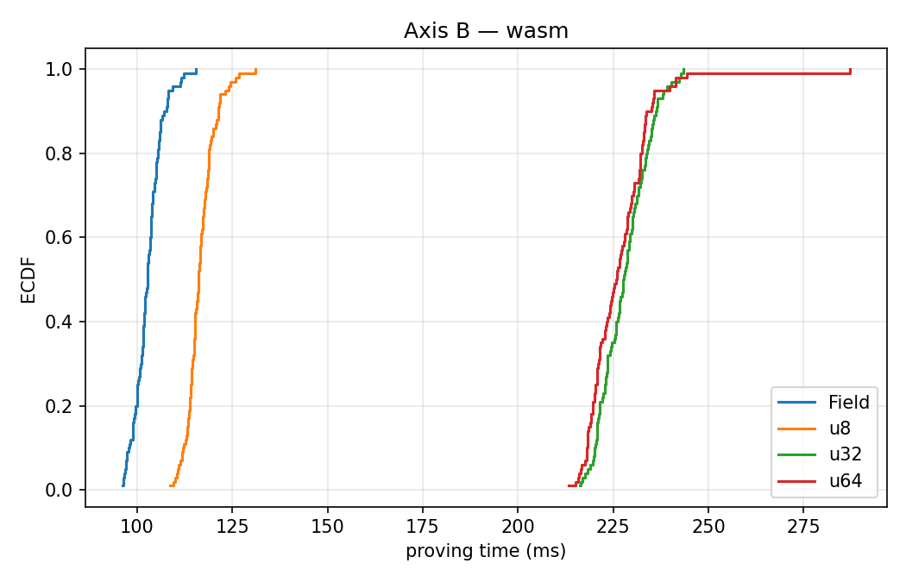

# Statistical Analysis Report

## Input inventory

- `results/native/session-20260718T025555Z.jsonl` — environment **native**, label `pilot`, seed 2928077471, git `8a44bb26`
- `results/wasm/session-20260718T133509Z.jsonl` — environment **wasm**, label `pilot`, seed 871938275, git `d29639e7`
- `results/circuit-metrics.json`
- `results/proof-metrics.json`
- `results/gas/gas-metrics.json`

Significance level: alpha = 0.05 (two-tailed). Saturated pairs (complete separation) report the exact permutation bound p = 2/C(n+m, n) instead of the asymptotic Brunner-Munzel statistic (spec 006 FR-3b).

## Failure-rate gates

| env | condition | ok | failure rate | latency analysis |
|---|---|---|---|---|
| native | Field | 100/100 | 0.0% | included |
| native | u8 | 100/100 | 0.0% | included |
| native | u32 | 100/100 | 0.0% | included |
| native | u64 | 100/100 | 0.0% | included |
| wasm | Field | 100/100 | 0.0% | included |
| wasm | u8 | 100/100 | 0.0% | included |
| wasm | u32 | 100/100 | 0.0% | included |
| wasm | u64 | 100/100 | 0.0% | included |

## Axis A — execution environment (native vs. WASM32)

| condition | native median [IQR] (ms) | wasm median [IQR] (ms) | slowdown | p_hat P(nat<wasm) | p-value |
|---|---|---|---|---|---|
| Field | 38.6 [36.7, 40.5] | 102.8 [100.3, 105.0] | 2.66x | 1.00 | <= 2.21e-59 (sat.) |
| u8 | 41.6 [39.6, 44.3] | 116.1 [114.2, 118.6] | 2.79x | 1.00 | <= 2.21e-59 (sat.) |
| u32 | 97.9 [94.1, 101.7] | 227.7 [223.1, 232.6] | 2.33x | 1.00 | <= 2.21e-59 (sat.) |
| u64 | 96.2 [93.9, 98.8] | 225.8 [220.7, 231.9] | 2.35x | 1.00 | <= 2.21e-59 (sat.) |

## Axis B — bit-width vs. Field baseline (Holm-Bonferroni)

### native

| comparison | p_hat P(var<Field) | p-value | Holm threshold | decision |
|---|---|---|---|---|
| u8-vs-Field | 0.25 | 5.06e-11 | 0.0500 | reject H0 |
| u32-vs-Field | 0.00 | <= 2.21e-59 (sat.) | 0.0167 | reject H0 |
| u64-vs-Field | 0.00 | <= 2.21e-59 (sat.) | 0.0250 | reject H0 |

### wasm

| comparison | p_hat P(var<Field) | p-value | Holm threshold | decision |
|---|---|---|---|---|
| u8-vs-Field | 0.01 | 4.51e-113 | 0.0167 | reject H0 |
| u32-vs-Field | 0.00 | <= 2.21e-59 (sat.) | 0.0250 | reject H0 |
| u64-vs-Field | 0.00 | <= 2.21e-59 (sat.) | 0.0500 | reject H0 |

Supplementary (no family correction): u32 vs u64, native: p_hat = 0.44, p = 1.30e-01.

## Deterministic metrics (exact comparison — no hypothesis testing)

| variant | ACIR opcodes | backend gates | proof (B) | exec gas | calldata std | calldata floor | blob gas |
|---|---|---|---|---|---|---|---|
| Field | 5 | 40 | 4928 | 1838390 | 76464 | 191160 | 4992 |
| u8 | 11 | 93 | 5312 | 1899684 | 82668 | 206670 | 5376 |
| u32 | 11 | 2791 | 7232 | 2206708 | 113208 | 283020 | 7296 |
| u64 | 11 | 2838 | 7232 | 2206708 | 113172 | 282930 | 7296 |

Gas measured on Sepolia fork block 11300032 (chain 11155111), compilation profile optimizer_runs = 1 (EIP-170 fit).

## Figures

